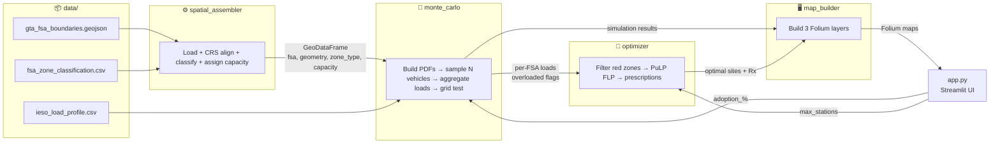

# Project Architecture

## Project Structure

```
seneca-hack/
├── app.py                          # Streamlit entry point — wires sidebar, views, and session state
├── requirements.txt                # Pinned Python dependencies
├── .streamlit/
│   └── config.toml                 # Streamlit theme (dark mode, accent color)
│
├── data/
│   ├── gta_fsa_boundaries.geojson  # GTA FSA polygons (~150 zones, EPSG:4326)
│   ├── ieso_load_profile.csv       # 24-hour baseline load curve (normalized 0–1)
│   └── fsa_zone_classification.csv # FSA → zone_type mapping (residential/commercial/industrial)
│
├── src/
│   ├── __init__.py
│   ├── spatial_assembler.py        # Phase 1 — GeoJSON ingestion, CRS alignment, spatial join, capacity assignment
│   ├── monte_carlo.py              # Phase 2 — Spatial/temporal PDFs, vectorized sampling, load aggregation, grid test
│   ├── optimizer.py                # Phase 3 — PuLP FLP solver, asset prescription, BESS sizing
│   └── map_builder.py              # Phase 4 — Folium map construction (choropleth, vulnerability, placement layers)
│
├── docs/
│   ├── README.md                   # Docs index
│   ├── architecture.md             # This file
│   ├── blueprint.md                # Original hackathon blueprint
│   └── implementation_plan.md      # Detailed implementation plan
│
└── README.md                       # Project overview, setup instructions, usage
```

---

## Module Responsibilities

### `app.py` — Streamlit Entry Point

The single-page application that ties everything together:

- Configures page layout (wide, dark theme)
- Renders sidebar controls (EV adoption slider, station count slider, action buttons)
- Manages `st.session_state` to persist simulation/optimizer results across re-runs
- Renders 3 stacked map views by calling `map_builder`

```
Sidebar Controls → session_state → Phase 2/3 engines → map_builder → Folium render
```

---

### `src/spatial_assembler.py` — Phase 1

**Input:** Raw GeoJSON + zone classification CSV  
**Output:** Enriched GeoDataFrame (`fsa`, `geometry`, `zone_type`, `proxy_capacity_kw`)

| Step | Operation |
|------|-----------|
| 1 | Load FSA boundary polygons via `gpd.read_file()` |
| 2 | Validate/reproject CRS to EPSG:4326 |
| 3 | Join zone classification (residential / commercial / industrial) |
| 4 | Assign proxy capacity headroom per zone type |

```python
# Proxy capacity mapping
CAPACITY_MAP = {
    "residential":  300,   # kW — fragile neighborhood transformers
    "commercial":   1200,  # kW — heavier commercial service
    "industrial":   2500,  # kW — heavy-duty industrial feeders
}
```

---

### `src/monte_carlo.py` — Phase 2

**Input:** Enriched GeoDataFrame + IESO load profile + adoption %  
**Output:** Per-FSA results (`peak_ev_load_kw`, `total_load_kw`, `overloaded`, `deficit_kw`)

#### Spatial PDF (where)
- Weight each FSA by zone type (commercial/residential = high, transit = ~0)
- Normalize to proper probability distribution

#### Temporal PDF (when)
- Mixture of two normals: evening `N(17.5, 1.5)` at 70% + midday `N(12.0, 2.0)` at 30%
- Discretized into 24 hourly bins

#### Sampling & Aggregation
```
For N simulated vehicles (vectorized via NumPy):
  1. Draw destination FSA     ← spatial PDF
  2. Draw arrival hour        ← temporal PDF
  3. Draw battery deficiency  ← N(5.4, 2.0) kWh, clipped [1, 20]
  4. Assign charger draw      ← 50 kW (commercial) or 7 kW (residential)

GroupBy (FSA, hour) → peak_ev_load_kw per FSA
```

#### Grid Inequality Test
```
total_load = peak_ev_load + (baseline_fraction[peak_hour] × proxy_capacity)
overloaded = total_load > proxy_capacity
deficit_kw = max(0, total_load - proxy_capacity)
```

---

### `src/optimizer.py` — Phase 3

**Input:** Overloaded FSAs from Phase 2 + max station count  
**Output:** List of optimal sites with prescriptions

#### Facility Location Problem (PuLP)
```
Maximize:  Σ deficit[i] × coverage_weight[i][j] × x[i][j]
Subject to:
  Σ y[j] ≤ max_stations          (budget)
  x[i][j] ≤ y[j]                 (linking)
  Σ x[i][j] ≤ 1  for each i      (demand cap)
  y[j] ∈ {0, 1}, x[i][j] ∈ [0,1]
```

#### Safety Guards
- Cap budget at number of candidate sites (prevents infeasibility)
- Handle zero-overloaded edge case gracefully

#### Asset Prescription
| Zone | Charger Type | BESS Sizing |
|------|-------------|-------------|
| Commercial | 4× 50 kW DC Fast Array | `deficit_kw × 2` kWh |
| Residential | 8× 7 kW Level 2 Hub | `deficit_kw × 2` kWh |

---

### `src/map_builder.py` — Phase 4

**Input:** GeoDataFrame + simulation results + optimizer results  
**Output:** Folium map objects for each view

| View | Layer Type | Visual |
|------|-----------|--------|
| **1 — Energy Spikes** | `Choropleth` | Yellow → orange → red by `peak_ev_load_kw` |
| **2 — Grid Vulnerability** | `GeoJson` with `style_function` | Green (safe) vs. red (overloaded) polygons |
| **3 — Optimal Placement** | Green/red polygons + purple `Marker` pins | Pins with HTML popup prescription cards |

---

## Data Flow



---

## Key Dependencies

```
streamlit
streamlit-folium
folium
geopandas
shapely
numpy
pandas
pulp
```
