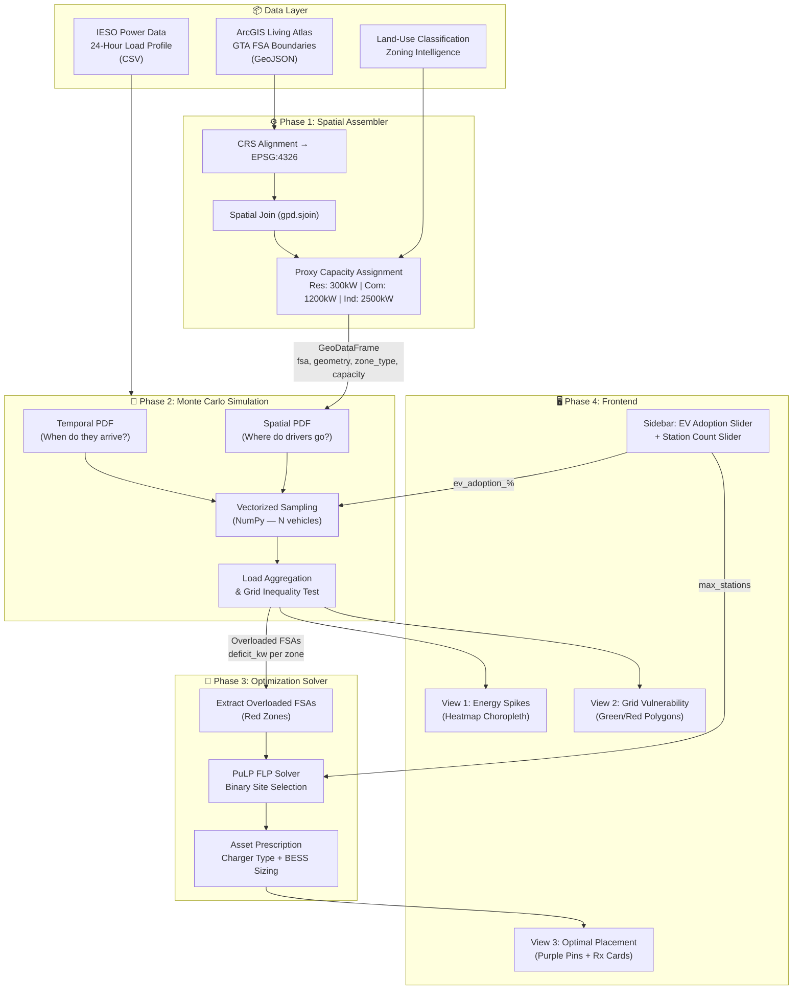

# EV Charging Demand & Grid Planning — Implementation Plan

## Background & Goal

Build an interactive, predictive **Location Optimization & Grid Impact Model** for the Seneca Energy Hackathon 2026. The system ingests GTA spatial/GIS data and IESO grid profiles, derives probability density functions of vehicle movement across Ontario, runs Monte Carlo simulations to predict localized EV charging demand spikes, flags grid failures via inequality testing, and prescribes optimal charger placement using a Facility Location Problem solver.

**Timeline:** 48 hours | **3 developers** | **Local development** (deployment deferred)

---

## High-Level System Architecture



**Data flows top-down** through four phases. The sidebar controls (bottom) feed back into Phases 2 and 3, creating the reactive loop: adjust slider → re-simulate → re-render map.

---

## Tech Stack & Key Libraries

| Layer | Technology | Purpose |
|-------|-----------|---------|
| **App Framework** | Streamlit | Interactive UI, reactive sidebar widgets, session state management |
| **Geospatial Maps** | Folium (Leaflet.js base) + `streamlit-folium` | Choropleth polygon rendering, heatmaps, clickable marker popups |
| **Geospatial Processing** | GeoPandas + Shapely | Vector geometry operations, CRS alignment, spatial joins (`gpd.sjoin`), polygon overlay analysis |
| **Numerical Simulation** | NumPy | Vectorized Monte Carlo sampling, array operations, probability distribution generation |
| **Data Wrangling** | Pandas | Tabular data manipulation, groupby aggregation, time-series load curve processing |
| **Optimization** | PuLP (CBC solver) | Mixed-integer linear programming for the Facility Location Problem |
| **Data Formats** | GeoJSON + CSV | FSA boundary polygons (GeoJSON), load profiles & trip distributions (CSV) |

### Why Streamlit + Folium (not Next.js or Dash)

- **Streamlit** keeps the entire stack in Python — the same language as NumPy/GeoPandas/PuLP. No API layer needed, no language split.
- **`st.cache_data`** eliminates the "re-run entire script" penalty. Heavy computations (Monte Carlo, spatial joins) are cached and only re-execute when inputs change.
- **Folium** excels at exactly what we need: **polygon choropleths** (FSA boundaries colored green/red) + **marker pins** with HTML popups. PyDeck is better for 3D point clouds, but our primary visual is 2D polygon styling.
- **`streamlit-folium`** provides a mature bridge that handles bidirectional map interaction within Streamlit.

---

## Data Sourcing Strategy

Following the blueprint, all data is derived from public GIS sources and IESO profiles. No private utility data is needed.

### 1. GTA FSA Boundaries (The Geographic Canvas)

**Source:** Statistics Canada Census Forward Sortation Area Boundary File, filtered to full GTA coverage.

- **Scope:** All GTA FSAs (~150 polygons) — M-prefix (Toronto) + L-prefix (Peel, York, Durham, Halton). Including the full GTA is straightforward; GeoPandas handles 150 polygons with zero performance concern. The vectorized operations on this scale complete in milliseconds.
- **Format:** GeoJSON, pre-filtered and committed to the repo (typically 1-5 MB for simplified geometries)
- **CRS:** All geometry normalized to EPSG:4326 (WGS84) — the universal GPS coordinate system. GeoPandas' `.to_crs()` handles reprojection automatically if the source uses a different datum.
- **Technology:** `gpd.read_file()` ingests GeoJSON directly into a GeoDataFrame, binding a `geometry` column (Shapely Polygon objects) to each tabular row.

### 2. GIS Land-Use Classification (The Zoning Intelligence)

**Source:** ArcGIS Living Atlas regional GIS layers — land-use type attributes per FSA.

The blueprint's core behavioral axiom is: **"Drivers charge where they park, not where they drive."** To operationalize this, each FSA polygon must be classified by its dominant land-use type, which determines both the spatial probability weight and the proxy grid capacity.

**Classification Logic:**
- FSA polygons are enriched with land-use attributes from Living Atlas layers. Where direct attribute data isn't available, we apply a heuristic classification based on FSA prefix patterns and known urban geography:
  - **Commercial/High-density:** Downtown core FSAs, major retail/corporate nodes
  - **Residential:** Suburban neighborhoods, condo complexes
  - **Industrial/Transit:** Highway corridors, industrial parks
- This classification feeds into two downstream systems: the spatial PDF (Phase 2) and the proxy capacity ceiling (below).

### 3. Proxy Grid Capacity (Option B — Smart Zoning Rule)

**Source:** Derived from land-use classification (not from real substation data, which is behind utility firewalls).

Following the blueprint's "Option B" approach, each FSA receives a proxy grid headroom ceiling based on its zone type. This mirrors the real-world fact that different urban zones have different transformer and feeder capacities:

| Zone Type | Proxy Capacity Headroom | Rationale |
|-----------|------------------------|-----------|
| Residential | 300 kW | Fragile neighborhood transformers, limited feeder capacity |
| Commercial/Retail | 1,200 kW | Heavier commercial service, larger transformers |
| Industrial/Highway | 2,500 kW | Heavy-duty industrial feeders, high-capacity infrastructure |

### 4. IESO Baseline Load Profile (The Existing Grid Stress)

**Source:** IESO (Independent Electricity System Operator) publicly available hourly Ontario demand reports.

- A 24-hour baseline load curve is constructed from IESO historical data, representing the **existing non-EV electrical demand** on the grid at each hour.
- This curve is normalized to a fractional profile (0.0–1.0) and then scaled per-FSA based on zone type and population density.
- The curve shape shows a trough at hours 2–5 AM (overnight minimum) and peaks at hours 17–20 (evening domestic demand) — which critically **coincides with peak EV arrival times**, compounding the grid stress.

---

## Phase 1: The Spatial Assembler

**Goal:** Ingest raw geographic data, align coordinate systems, classify zones, and establish grid capacity ceilings.

### Core Logic

1. **GeoJSON Ingestion & CRS Alignment**
   - Load GTA FSA boundary polygons using GeoPandas (`gpd.read_file()`).
   - Validate that the Coordinate Reference System is EPSG:4326. If the source data uses a projected CRS (e.g., StatCan's Lambert Conformal Conic), reproject using `.to_crs(epsg=4326)`.
   - This ensures GPS coordinate points from mobility data correctly intersect with FSA polygon boundaries during spatial joins.

2. **Spatial Join Operation**
   - Using `gpd.sjoin()` with an `intersects` predicate, mobility/arrival coordinate points are mapped into their containing FSA polygon.
   - This is the fundamental bridge between point-level vehicle data and polygon-level grid analysis — it answers "which neighborhood does this car belong to?"
   - GeoPandas builds an R-tree spatial index under the hood, making this operation O(n log n) rather than brute-force O(n²).

3. **Land-Use Classification & Capacity Assignment**
   - Each FSA polygon is tagged with a `zone_type` based on GIS land-use data.
   - Proxy capacity headroom is assigned per the zoning rule table above.
   - **Output:** A GeoDataFrame with columns: `fsa`, `geometry`, `zone_type`, `proxy_capacity_kw`

### Key Libraries
- **GeoPandas** — spatial data structures, `gpd.sjoin()`, CRS operations
- **Shapely** — polygon geometry objects, centroid calculation, intersection tests

---

## Phase 2: The Stochastic Behavioral Simulation Engine (Monte Carlo)

**Goal:** Model driver timing and location uncertainty via custom probability distributions, then run a vectorized stress test of the electrical grid during peak periods.

This is the algorithmic heart of the project. Instead of deterministic predictions, we model the inherent uncertainty of human behavior using probability density functions and Monte Carlo sampling.

### Deriving the Spatial PDF — "Where Do Drivers Go?"

The spatial probability density function determines **where** simulated vehicles park and charge. It's derived directly from GIS data:

- Each FSA polygon receives a **dwell-time weight** based on its land-use classification:
  - **Commercial zones** (shopping centers, corporate parks) → **High weight** — drivers park for extended periods during work/shopping
  - **Residential zones** (condo complexes, suburban neighborhoods) → **High weight** — overnight parking with long plug-in windows
  - **Transit/Highway corridors** → **Near-zero weight** — drivers pass through, they don't park here
- These weights are normalized into a proper probability distribution that sums to 1.0.
- The result is a **probability surface** over the GTA map: each FSA has a specific probability of being a vehicle's destination.

**Mathematical formulation:**
```
P(vehicle parks in FSA_i) = weight(zone_type_i) / Σ weight(zone_type_j) for all j
```

### Deriving the Temporal PDF — "When Do Drivers Arrive?"

The temporal probability density function determines **when** vehicles plug in. It's derived from IESO historical load profiles and commuting patterns:

- A 24-hour arrival probability curve is constructed using a **mixture of two normal distributions**:
  - **Evening commuter peak:** `N(μ=17.5, σ=1.5)` — steep probability plateau between 5:00 PM and 8:00 PM when GTA residents finish commuting
  - **Midday commercial peak:** `N(μ=12.0, σ=2.0)` — moderate bump for daytime commercial charging
- The mixture heavily weights the evening peak (~70%) over the midday peak (~30%), reflecting the blueprint's behavioral model.
- This curve is discretized into 24 hourly bins and normalized.

**Why this matters:** The evening EV arrival peak coincides with the existing IESO grid demand peak — this temporal collision is exactly what creates grid stress, and the simulation must capture it.

### Vectorized Monte Carlo Sampling

Instead of slow Python `for` loops, the entire simulation runs as vectorized NumPy array operations:

1. **Fleet Scaling:** Given the user's EV adoption slider (10%–50%), calculate the simulated fleet size. For performance, we sample a representative subset (e.g., 5,000–10,000 vehicles) and scale the results.

2. **Multi-dimensional Sampling:** For each simulated vehicle, NumPy simultaneously draws:
   - A **destination FSA** from the spatial PDF → `np.random.choice(fsa_indices, size=N, p=spatial_probs)`
   - An **arrival hour** from the temporal PDF → `np.random.choice(hours, size=N, p=temporal_probs)`
   - A **battery deficiency** (kWh needed) from a normal distribution based on average GTA commute distances (~30 km, EV efficiency ~0.18 kWh/km) → `np.random.normal(mean=5.4, std=2.0, size=N).clip(1, 20)`

3. **Charger Profile Assignment:** Based on the destination FSA's zone type:
   - **Commercial polygons** → DC Fast Charger draw: **50 kW** (short, rapid parking windows)
   - **Residential polygons** → Level 2 Charger draw: **7 kW** (long, overnight parking)

4. **Load Aggregation:** Using Pandas `groupby`, all active vehicle loads are aggregated by (FSA, hour) to produce a load curve per neighborhood. The peak load per FSA is the maximum across all hours.

### Grid Headroom Inequality Testing

The core structural equation from the blueprint:

$$\text{Simulated EV Charging Draw} + \text{IESO Baseline Load} > \text{Localized Feeder Capacity}$$

For each FSA, the engine evaluates:
```
total_load = peak_ev_load_kw + (baseline_load_fraction[peak_hour] * proxy_capacity_kw)
overloaded = total_load > proxy_capacity_kw
deficit_kw = max(0, total_load - proxy_capacity_kw)
```

Any FSA where `overloaded == True` is flagged as a grid failure zone — these become the **red polygons** on the map and the **candidate sites** for the optimization solver.

### Performance Target
- **< 2 seconds** for 5,000 simulated vehicles across ~150 FSAs
- Achieved via fully vectorized NumPy operations (no Python loops)
- Results cached with `@st.cache_data` — slider changes only re-trigger the simulation when the adoption percentage actually changes

---

## Phase 3: The Prescriptive Optimization Solver (Facility Location Problem)

**Goal:** Given the grid failure zones from Phase 2, calculate the mathematically optimal locations to deploy new charging infrastructure.

### The Mathematical Framework

This is modeled as a **Facility Location Problem (FLP)** — a classic operations research optimization solved via mixed-integer linear programming (MILP).

**Why PuLP:** PuLP is a Python LP modeler that interfaces with the CBC (Coin-or Branch and Cut) solver. It handles binary decision variables and linear constraints natively, and the CBC solver ships bundled with PuLP — no external solver installation needed.

### Problem Formulation

**Sets:**
- `I` = set of demand zones (overloaded FSAs from Phase 2)
- `J` = set of candidate charging station locations (centroids of overloaded FSA polygons)

**Decision Variables:**
- `y[j] ∈ {0, 1}` — binary: open a charging station at candidate location j?
- `x[i][j] ∈ [0, 1]` — continuous: fraction of demand from zone i served by station j

**Objective Function — Maximize Demand Coverage:**
```
Maximize: Σ_i Σ_j (deficit_kw[i] × coverage_weight[i][j] × x[i][j])
```
Where `coverage_weight[i][j]` is the inverse haversine distance between zones i and j, encouraging proximity-based placement.

**Constraints:**
1. **Budget Constraint:** `Σ_j y[j] <= max_stations` — total deployed stations must not exceed the user-selected budget (sidebar slider, 5–20 units)
2. **Linking Constraint:** `x[i][j] <= y[j]` — demand can only be served by an open station
3. **Demand Cap:** `Σ_j x[i][j] <= 1` for each i — each zone's demand is counted at most once

### ⚠️ Infeasibility Safety Shield

If the user slides the station budget **higher** than the total number of overloaded FSAs (red zones), the solver has more slots than candidates — PuLP will return an `"Infeasible"` status, crashing the backend.

**Mandatory pre-solve validation:**
```python
# Force budget to cap safely at unique candidate count
effective_budget = min(target_infrastructure_count, len(unique_candidate_sites))
```

Additionally, the solver must handle the **zero-overloaded edge case**: if the simulation finds no grid failures (e.g., at 10% adoption), the optimizer should gracefully return an empty result set with a user-facing message ("No grid failures detected at this adoption level") instead of attempting to solve an empty problem.

### Asset Prescription Logic

Once the solver identifies optimal coordinates, a classification script generates engineering prescriptions:

- **Commercial coordinates** → Prescribed as **multi-port DC Fast Arrays** (e.g., 4× 50 kW chargers)
- **Residential coordinates** → Prescribed as **smart-sharing Level 2 Hubs** (e.g., 8× 7 kW chargers)
- **BESS (Battery Energy Storage System):** Because these chargers sit inside grid failure boundaries, each site receives a battery buffer prescription sized to absorb peak stress: `bess_kwh = deficit_kw × 2` (2-hour buffer capacity)

### Output: Prescription Cards

Each optimized site produces a structured prescription:
```
📍 Optimal Site Location Found
• Coordinate Zone: FSA L4C (GTA North Region)
• Predicted Peak Deficit: +450 kW
• Prescribed Infrastructure: 4x Level 2 Smart-Charging Stations
• BESS Buffer: 200 kWh local Battery Energy Storage System
```

---

## Phase 4: The Frontend Command Center

**Goal:** Wire all backend modules into an interactive Streamlit application with a single scrollable page containing three progressive visual insights.

### Application Layout

- **Page config:** Wide layout, dark theme, custom primary color (electric blue/teal)
- **Sidebar:** Interactive controls (sliders, buttons) that drive the backend
- **Main area:** Single scrollable page with 3 stacked views

### Sidebar Controls

| Widget | Type | Range | Drives |
|--------|------|-------|--------|
| EV Adoption Rate | Slider | 10%–50% (step 5%) | Fleet size in Monte Carlo simulation |
| Max Charging Stations | Slider | 5–20 units | Budget constraint in PuLP optimizer |
| Run Simulation | Button | — | Triggers Phase 2 Monte Carlo engine |
| Optimize Placement | Button | — | Triggers Phase 3 PuLP solver (only after simulation) |

### View 1: Energy Spikes (The Problem)

- **Visualization:** Folium `Choropleth` layer over GTA map
- **Data:** `peak_ev_load_kw` per FSA from Monte Carlo results
- **Color scale:** Light yellow → deep orange → dark red (proportional to kW demand)
- **Interaction:** Hover tooltip shows FSA code, zone type, and peak load value
- **Story:** "Here's where EV charging demand concentrates during peak hours"

### View 2: Grid Vulnerability (The Conflict)

- **Visualization:** Folium `GeoJson` with conditional `style_function`
- **Logic:** Each FSA polygon is colored based on the grid inequality test:
  - `overloaded == False` → **translucent green fill** (grid can handle it)
  - `overloaded == True` → **intense dark red fill** (grid failure zone)
- **Interaction:** Tooltip displays FSA, zone type, total load vs. capacity, surplus/deficit in kW
- **Reactivity:** When the user adjusts the EV Adoption slider and re-runs the simulation, the green/red coloring updates dynamically — more red appears at higher adoption rates
- **Story:** "As EV adoption grows, these neighborhoods will experience grid failures"

### View 3: Prescriptive Charger Placement (The Solution)

- **Visualization:** Same green/red polygon base as View 2, with purple `folium.Marker` pins overlaid at optimized station locations
- **Markers:** High-visibility purple pins with custom HTML popup cards displaying the full engineering prescription (FSA, deficit, charger type, BESS sizing)
- **Story:** "Here's exactly where to build new infrastructure to prevent those failures"

### State Management

- **`st.session_state`** stores simulation results and optimizer output between Streamlit re-runs, preventing data loss when the user interacts with widgets
- **`@st.cache_data`** caches the expensive operations: GeoJSON loading, Monte Carlo simulation (keyed on adoption %), and PuLP optimization (keyed on station count)
- This ensures slider adjustments feel responsive (< 3 seconds) even though the underlying computations are heavy

### ⚠️ Bidirectional Map State Bottleneck Shield

While `streamlit-folium` renders Leaflet maps well, **any map interaction** (clicking a pin, zooming, panning) can force Streamlit to re-run the entire script from scratch. Without protection, this means every pin click re-triggers the Monte Carlo simulation and PuLP solver — freezing the UI for seconds.

**Non-negotiable caching rules:**
1. **All simulation functions** must be wrapped in `@st.cache_data` with explicit input keys (adoption %, station count). Map clicks don't change these keys → no recalculation.
2. **The Folium map object** itself should be built in a cached function (`@st.cache_resource`) so re-renders reuse the existing map rather than rebuilding it.
3. **`st.session_state`** must gate the "Optimize" button — optimizer results persist across re-runs and are only cleared when the user explicitly re-runs the simulation.
4. **Never put heavy computation outside a cache.** Any bare NumPy/Pandas operation in the main script body will execute on every single interaction.

---

## Verification Plan

### Functional Checks

1. **Data integrity:** GeoDataFrame has expected columns, CRS is EPSG:4326, no null geometries, ~150 FSA polygons loaded
2. **Monte Carlo sanity:** Total simulated vehicles matches expected count, all assigned FSAs exist in boundary set, peak loads are positive and within reasonable bounds (0–10,000 kW range)
3. **Optimizer validation:** Number of selected stations ≤ `max_stations`, all selected sites are in overloaded FSAs, PuLP returns "Optimal" solve status
4. **UI verification:** Run `streamlit run app.py` locally — all 3 views render, sidebar controls are wired, maps display correctly

### Visual Checks

1. Green/Red polygon boundaries align with real GTA geography
2. Changing EV adoption % visibly shifts green polygons to red
3. Clicking purple pins shows correct prescription card data
4. Scrolling through all 3 views tells a coherent story

### Fallback Strategy

If any phase blocks progress:
- **Phase 1 blocked (data):** Use simplified synthetic polygons instead of real FSA boundaries
- **Phase 2 blocked (simulation):** Use pre-computed static results, still show the slider UI
- **Phase 3 blocked (PuLP):** Replace with a greedy heuristic — place chargers at the top-N highest-deficit FSA centroids
- **Phase 4 blocked (Folium):** Fall back to `st.map()` with basic dot markers
